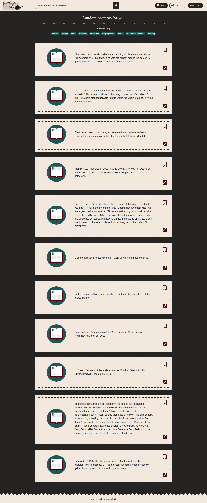

# Prompt Me

**Prompt Me** es una aplicación hecha en base a la API de Tumblr y Firebase. Muestra pequeños textos (obtenidos desde Tumblr a través de tags) que pueden servir para inspirar a los escritores aficionados a tener ideas o avanzar en sus escritos. Con la opción de registro, se da pie a ver muchos de estos mensajes (sin logear, solo podremos ver uno) y guardar los que quieras marcar (esto se almacena en la data del usuario a través de firebase), para luego acceder cuando quieras (y poder eliminarlos de tu lista, si lo deseas -a través de Firebase también-) a una sección especial dentro de la página que los muestre.

## Vista Previa

## Desarrollado por
[Victoria Tori Rodríguez](https://github.com/malditoprotozoo)

[Leticia Rodríguez Ferreira](https://github.com/helvette)

## Desarrollado Para
[Laboratoria](http://laboratoria.la/)